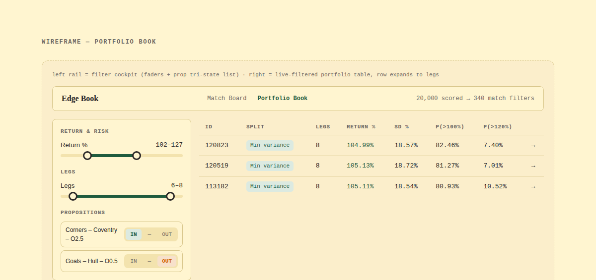

# proposition-portfolio

[](https://github.com/PKnott/proposition-portfolio/actions/workflows/tests.yml)

**Forecast football match statistics, find the bookmaker prices that disagree,
then build and size a portfolio of those positions.**

Four target families — goals, shots, shots on target, corners — modelled per team
per match across five leagues, priced against six books, and assembled into
portfolios that are scored on their *exact* discrete return distribution rather
than a normal approximation. The output is an interactive page you filter, not a
list you read.



The forecasting is the input. The interesting half is what comes after it: given
several dozen propositions whose prices look wrong, which *combination* of them,
staked how, and with what fraction of a bankroll.

## What it found

The staking model was rebuilt on the back of a study of how portfolio size drives
variance and stake. Its results are specific, and they are checked in code rather
than asserted:

| | |
|---|---|
| **Sharpe² = Σ Sᵢ²** | Portfolio Sharpe under edge-aware weights is the root of the summed squared leg Sharpes — exactly. Verified to **1e-16** on real slates, and pinned by a test. One scalar, additive over legs, orders every selection. |
| **The protective stake is 0.111 × Kelly** | A 4,000-path drawdown simulation turns out to compute a fixed fraction of Kelly: r = 0.998, worst residual 6.2%. The risk appetite was three constants nobody could see. |
| **The old stake split cost ~39% of growth** | Both previous splits allocated on how *quiet* a leg was and ignored its edge. On one real book, minimum-variance put 25.5% of stake on the worst proposition in it and 4.3% on the best. |
| **Same-match propositions correlate at +0.455** | Measured over 1,438 settled pairs — not assumed. Opposite teams in the same match correlate **negatively** (−0.185), making them worth *more* than an unrelated leg. Placebo across matches: −0.013. |

The study also caught an error in its own method — a sign flip in the correlation
model that had overstated a headline result by 35% — which is written up alongside
the findings rather than quietly corrected.

## How it fits together

| Stage | Notebook | What it does |
|---|---|---|
| Ingest | `00_Data_Pull` | Pull match history |
| Clean | `01_Cleaning` | One canonical table |
| Features | `02_Features` | Rolling team form, opponent adjustment, promotion priors |
| Tune | `03_Tuning` | Walk-forward CV; alternating window/hyperparameter loop |
| Evaluate | `04_Evaluation` | Held-out seasons, touched once |
| Predict | `05_Run` | Score fixtures → predictions workbook + blank odds form |
| **Portfolio** | `06_Split` | Edge detection, portfolio search, staking, the Edge Book |
| Settle | *(being rebuilt)* | Capture, settle and score what was actually bet |

`fpp/` holds the logic; the notebooks are thin drivers. The settlement stage is
being rewritten and is not published yet — `fpp/ledger.py` and `fpp/analysis.py`
are the machinery it drives.

## Provenance

Carries forward the modelling from
[`Football_Prediction_Project`](https://github.com/PKnott/Football_Prediction_Project),
which was a per-league prediction exercise. What changed there: four pooled models
instead of five per-league ones, walk-forward validation instead of a single split,
and a package instead of duplicated notebooks. Everything about portfolio
construction and staking is new, and is what this project is for.

---

## Setup

**Python 3.11+** (currently running on 3.14.0, macOS).

> The original README warned that Python 3.13 was unsupported. That is no longer
> true — `soccerdata` 1.9 declares `>=3.10,<3.15`, and every other dependency
> publishes current wheels.

The venv lives in `Advanced_Football_Project/`, not `.venv`:

```bash
python3 -m venv Advanced_Football_Project
source Advanced_Football_Project/bin/activate
pip install -r requirements.txt
pip install -e .
```

Use that interpreter for everything — notebooks, `pytest`, the scripts in
`scripts/`. An empty `.venv/` directory is also present and is not the
environment; reaching for it by habit is the easiest way to end up on a bare
interpreter with no numpy.

### Two macOS-specific steps

**1. SSL certificates.** A fresh python.org install ships with an empty OpenSSL
trust store, so every HTTPS request fails with `CERTIFICATE_VERIFY_FAILED` — which
would break all ingestion. Run the installer's own script (needs admin rights):

```bash
"/Applications/Python 3.13/Install Certificates.command"
```

`fpp` also points the stdlib at `certifi` on import as a fallback, so `requests`
(and therefore `soccerdata`) works even if you skip this.

**2. OpenMP for XGBoost.** The XGBoost macOS wheel expects `libomp.dylib` at a
Homebrew path. With Homebrew installed, `brew install libomp`. Without it, this
repo borrows the copy that ships inside the scikit-learn wheel — one shared
OpenMP runtime for both libraries, which is the correct configuration anyway:

```bash
python scripts/fix_xgboost_libomp.py
```

Re-run that after any `pip install --upgrade xgboost`.

---

## Layout

```
fpp/                        the pipeline package
├── config.py  paths.py     league/target registries, filesystem layout
├── spec.py                 declarative feature spec — the single source of truth
├── ingest/                 understat, espn, scoreboard stats, retry plumbing
├── clean.py                canonical table + integrity and dispersion checks
├── priors.py  build.py     vectorised walk-forward buffers -> feature matrix
├── models.py  metrics.py   objectives, Poisson/NB distributions, losses
├── cv.py                   expanding-window season folds, tuning/holdout split
├── search/                 resumable window / feature / hyperparameter search
├── artifacts.py            frozen artifacts + RunContext
├── evaluate.py             held-out test scoring, significance, calibration
├── predict.py              production training and fixture scoring
├── staking.py              price, edge, (P, O) dominance, stake allocation
├── portfolio.py            which propositions to back together, and in what mix
├── ledger.py               capture, settle, and keep — what we said vs what happened
├── analysis.py             the four questions asked of the ledger
└── report/                 market probabilities, the workbooks and the JSON export

Notebooks/                  thin drivers — config, calls, display
├── 00_Data_Pull  01_Cleaning  02_Features
├── 03_Tuning     04_Evaluation  05_Run  06_Split
└── (07_Analysis is being rebuilt and is not in this repo)

app/edge-book/                  the Edge Book front end — index.html, css, js
artifacts/<target>/<version>/   frozen: window, features, params, cv, provenance
Inputs/                         source data (gitignored)
Outputs/                        three files you open, everything else in a folder
├── predictions_<date>.xlsx     the read-only view
├── odds_input_<date>.xlsx      the form to fill
├── edge_book_<date>.html       the page
├── Data/                       what the pipeline reads and writes, not you
├── Archive/<kind>/             every superseded copy
├── Evaluation/                 written by 04_Evaluation
└── Analysis/                   the ledger — the one store that cannot be rebuilt
tests/                          regression guards
~/.cache/football_prediction/   clean table + search checkpoints (outside iCloud)
```

**Which file is the current one is answered by position, not by date.** Every
writer moves what it supersedes into `Archive/<kind>/` on its way out, so the
`Outputs` root only ever holds one predictions workbook, one odds form and one
page. `latest_form()` and `latest_json()` depend on that, and
`tests/test_outputs_layout.py` holds the writers to it; `fpp.paths.tidy_outputs()`
puts a root that has drifted back into shape.

`Data/` keeps no history on purpose. The two JSON payloads rebuild from the
workbook and the form in seconds, the odds-gathering files are consumed inside a
single run, and yesterday's page is archived whole — so a dated pile of any of
them is a pile nothing would read.

**`Analysis/` is the exception, and the only one.** Everything else here
regenerates: re-run the notebook and the artifact comes back. A result nobody
captured is gone, so the ledger is the one store whose loss cannot be undone by
running anything — which is why it sits outside both `Data/` and the root, where
`keep_newest`, `stow_working`, `prune_data` and `_write_json` cannot reach it.

Large, churny files live outside the repo deliberately: this project sits in
iCloud Drive, where hundreds of MB of grid checkpoints cause constant upload churn
and "Optimise Mac Storage" can evict a file mid-search. Override the location with
`FPP_CACHE_DIR`.

**Checkpoint validity is structural, not a discipline.** A cached score is only
meaningful for the configuration that produced it, and `point_id` encodes only the
group id and its subset. So the *filename* carries the guard, in two layers:

- `paths.search_checkpoint()` appends the scoring mode, defaulted from
  `config.SCORING_MODE` so no caller can forget it.
- `search/stages.py` folds a SHA of the group structure, the `(L, alpha)` window
  and `spec.scoring_hash()` (mode, distributions, both caps) into the per-run
  filename.

Change the metric or a cap and the old rows become *unreachable* rather than
silently reusable. `artifacts.spec_hash()` applies the same rule to frozen
artifacts, so `RunContext.load()` refuses a version frozen under a different
feature spec **or** a different scoring definition.

Rows appended to one checkpoint do not all share a schema — stage 5 has no
`groups` column, each hyperparameter block names its own axes — so
`runner.append_row` aligns every row to the file's existing header. Without that,
a differently-keyed row lands positionally under the first row's header and
`score_mean` silently reads `score_se`.

---

## How to use it

### First build

Run `00` → `01` → `02` → `03` → `04` once, in order. This pulls the full history,
builds the canonical dataset, selects features, tunes, and produces an honest
held-out evaluation. Sets `artifacts/` for all four target families.

### Day to day

Open `05_Run`, set the date range, run top to bottom. It never touches the
research notebooks and re-derives nothing — it loads frozen artifacts and scores.
Typically 3–5 minutes, mostly network.

Two workbooks come out. `predictions_<date>.xlsx` is the read-only view: every
fixture, every market, coloured against its league. `odds_input_<date>.xlsx` is a
form — the same sheet names, every proposition each fixture is priced at, and one
blank column per book in `staking.BOOKS`.

**Every** proposition: `MIN_MODEL_P` is zero. The old 50% floor existed when the
form was typed in by hand, and it cut out the entire low-probability half of
every ladder — which is precisely where a book's margin is widest and an edge,
when there is one, is largest. The `fill-odds` skill populates the form from
Oddschecker, so breadth costs a lookup rather than a keystroke. A 39-fixture week
is 74 propositions per fixture and 2,886 rows.

Fill it in, then run `06_Split`. It reads the form and nothing else (each row
carries its own model probability, so there is no matching back to the
predictions workbook), keeps the prices that beat the model, and searches for the
best *mixes* of them.

One control governs the search: **`LEG_VAR`, how many qualifying events a
portfolio may leave out.** Zero requires one bet from every one of them, which is
the only setting whose answer is provable — the space collapses to something that
enumerates, so every portfolio is scored rather than searched. It is deliberately
*relative*, because how many events qualify is not knowable when you set it: a
45-fixture weekend might yield 43 events or 37 depending on which markets got
priced and which cleared `E >= 1`, and an absolute floor typed against a guess
quietly becomes "skip nothing" if fewer qualify.

Expect the funnel to be steep — and then to open out. A real 39-fixture week gave
810 propositions on the form, 180 of them priced by at least one book, 57 clearing
`E >= 1` across 26 events, and 53 after per-event `(P, O)` dominance. Those 53
make **2.7 × 10¹¹** portfolios, of which the search returned 989 that nothing else
beats on expected return, variance and probability of profit at once.

That last number is the point. There is no single best portfolio: on that week the
highest expected return was a single 1.61× bet with a 141% standard deviation, the
lowest spread was all 26 events at 9.9%, and the highest probability of profit —
95% — was neither. So `06_Split` ends in a table you filter rather than a list you
read.

That table is now a page rather than a spreadsheet. See below.

### The Edge Book

`06_Split` ends in `Outputs/edge_book_<date>.html` — one self-contained file,
double-click it, no server and nothing to install. Three screens:

* **Match Board** — every fixture as a ticket; the selected one expands into its
  scoreline heatmap, 1X2/BTTS against the league's own rates, all four line
  ladders with an edge bar wherever a book quoted a price, and the propositions
  that survived to the portfolio search with how often the search picked each.
* **Portfolio Book** — the undominated set, filtered live by two-handle faders on
  every numeric column and by a three-way `IN / — / OUT` control over each
  proposition (or a whole event at once). A row expands to its legs, priced
  against whatever you type in the stake box. The filter set lives in the URL, so
  a view you spent ten minutes building can be bookmarked.
* **Projection Book** — one portfolio, compounded. Reached from `projection →` on
  an expanded row. The other two screens describe a single settlement; this one
  describes the same portfolio played every week and reinvested, which is what
  `fpp.growth` already answers and nothing previously drew.

**The Projection Book takes a pot, not a stake.** They are different quantities
and the page keeps them apart deliberately: the Portfolio Book's stake is what
goes on this portfolio once, and the pot is the bankroll a fraction is taken out
of every round, so `stake = f × pot`. Four panels — a p95/p50/p5 fan over 100
rounds at the suggested stake; the `g(f)` curve, which reads in either
direction (type a stake, get a rate; type a rate, get a stake); a return
calculator running both ways, pot-after-*n* and rounds-to-target; and every stat
on the portfolio, including the two the Portfolio Book has nowhere to put —
`P(returns nothing)` and the best case with its exact probability.

Two things it is careful about, because both are easy to misread:

* The pot column is the **median** path, shown with its p5–p95 band. Not an
  average, and not a forecast.
* `g(f)` is concave, so every rate below the peak is earned at *two* stakes. The
  read-off returns the lower one, and says why.

Every number on that screen assumes the model's probabilities are right, and
compounds that assumption a hundred times — which makes it the most
confident-looking view in the app. It says so on the page.

The newest page sits in the `Outputs` root; the one before it is in
`Outputs/Archive/edge_book/`.

It replaces the portfolio workbook, which Excel was the wrong tool for: filtering
20,000 rows interactively cost a `Query` sheet whose predicate had to be written
twice, once as a copied-down `Match` formula and once as a `FILTER()` block, and
5.7 MB a day. Set `WRITE_WORKBOOK = True` in `06_Split` to keep writing it too.

The page is built from two JSON files in `Outputs/Data/` — `predictions_<date>.json`
from `05_Run` and `portfolios_<date>.json` from `06_Split` — and the app source in
`app/edge-book/`. Only the undominated portfolios are exported (4,940 of 200,000
scored on a real form), each carrying its legs as an array of proposition ids
rather than duplicated rows. `write_edge_book` refuses to build if the two files
are from different runs: predictions and portfolios come from different notebooks,
and a page pairing yesterday's fixtures with today's portfolios would open looking
perfectly fine.

Edit the three files in `app/edge-book/` and re-run `fpp.report.write_edge_book()`
to rebuild against data already on disk — it takes about a second and needs no
model.

### After the matches — `07_Analysis`

Everything up to here is a forecast. `07` is the only place the pipeline finds
out whether the forecast was any good.

`06_Split` now writes each run into `Outputs/Analysis/Pending/` as it goes. That
has to happen there rather than here: `_write_json` deletes yesterday's
`portfolios_*.json` the instant today's lands, so a slate nobody captured before
the next run of `06` is gone. The inbox accumulates — run `06` five times before
`07` and five slates are waiting.

Run `07` once the fixtures have been played. It pulls fresh results, drains the
inbox into the permanent tables, settles every proposition whose match is done,
and rolls each frontier portfolio up into a realised return. Safe to run twice,
and safe to run early: a proposition with no result yet is left alone rather than
guessed at.

**Every ledger row is keyed structurally** — `(fixture date, league, home, away,
market, team, line)`. Never on `sheet_code`, which is positional: `E0-02` was
Everton v Palace, then Palace v Man City, then Coventry v Hull inside eight days.
Portfolio ids restart at 1 every run for the same reason, so a run carries a code
and the Edge Book prints `R007-770` on the betting slip. That string is what
`ledger.record_bet` takes.

The pot is a **balance the ledger keeps**, not a number retyped each round —
otherwise you stake 21% of a pot that stopped existing four losses ago:

```python
ledger.open_account(1000)                  # once
ledger.record_bet("R007-770")              # suggested; pot defaults to the balance
ledger.record_bet("R007-770", mode="max")  # or growth-optimal
ledger.record_bet("R007-770", f=0.15)      # or custom -- a fraction you chose
ledger.record_bet("R007-770", stake=150)   # or custom -- the cash you actually put on
ledger.deposit(250, note="topped up")      # money in and out, recorded as such
```

The three modes are the Edge Book slip's three buttons, named the same. An
explicit `f=` or `stake=` is always filed as `custom`: a stake the model did not
pick must not be recorded under a mode that says it did, because the strategy
analysis reads that column.

`ledger.bankroll()` is the statement: every cash movement and every bet in order,
with a running balance. A bet moves it by `stake × realised_return` once all its
legs have settled; until then it reads `pending` and the balance is unchanged,
because the stake is with the bookmaker and the outcome is not known yet.
Recording a bet is optional — skip it and the ledger holds no bet for that slate,
which is the truth.

**Excluding a run.** A slate priced by a superseded model is real but not
comparable, and pooling its probabilities into a calibration table would describe
a model nobody is running. `ledger.purge("R001", reason=...)` drops the data and
**keeps the run row**, marked `excluded` — which is what stops `backfill` pulling
it in again, and what lets the ledger say why its history starts where it does.

Four questions come out, into `Outputs/Analysis/Reports/` as CSVs and figures:

- **Is the model better than the price?** Log loss and Brier against `1/o` on the
  same settled rows. Nothing else matters if it is not.
- **Which markets and lines can be trusted?** Graded by the same `fpp.calibration`
  the held-out evaluation uses — and the first calibration in this project
  measured on the *dynamic* ladders that are actually bet rather than `spec`'s
  fixed four lines.
- **Does a claimed edge turn into money?** Realised return bucketed by `e` and by
  price. The shape is the finding: flat means `E >= 1` selects noise, falling
  means it selects the propositions where the model is most confidently wrong.
- **Which way of choosing a portfolio pays?** One pick off the frontier per rule
  per slate, then realised growth against what the Projection Book projected.

**The sample is slates, not rows.** A slate contributes hundreds of propositions
and thousands of portfolios, but its portfolios are overlapping combinations of
the same few dozen propositions and move together. Every table carries `n_slates`
beside `n`, and until that column reaches double figures nothing in the report is
evidence of anything.

### Start of season

Re-run `00_Data_Pull` with `MODE = "all"` (previous-seasons refresh, club mapping,
ESPN id cache, all-competition fixture history, and the shots/SOT/corners parse).

### Periodic re-validation

Re-run `04_Evaluation` against the updated dataset using the existing frozen
parameters, to check performance still holds. Only re-run `03_Tuning` if it drifts —
which is exactly what the stability re-check in `03` is there to detect.

---

## Portfolio construction and staking

This is the part the project is named after. Three questions, kept separate
because they have different answers.

### Which propositions to back together

Only prices that beat the model qualify, and within an event only those on the
`(P, O)` frontier. A portfolio takes **at most one proposition per event** — a
rule, not a finding, and every variance figure downstream assumes it.

Taking one from every event is `prod(k_i)` combinations, which enumerates. Letting
events be skipped is `prod(k_i + 1) - 1`, which on a real form is **2.7 × 10¹¹**
and does not. So the search is structural instead: every quantity a portfolio is
judged on is a **sum over its legs**, which makes the reachable space a Minkowski
sum that a dynamic programme can walk. Where the whole space fits under
`EXHAUSTIVE_MAX` it is enumerated exactly instead, and the payload records which
claim it is making.

### How to split the stake across them

Weight each leg by `mu_i / v_i` — inverse variance times edge, where
`mu_i = o_i p_i - 1`. Write `c_i = mu_i² / v_i` and `w_i = mu_i / v_i`; then with
`C = Σ c_i` and `W = Σ w_i`:

```
stake_i              =  w_i / W
expected return - 1  =  C / W
variance             =  C / W²
Sharpe               =  √C
```

That last line is why there is one split rather than the three this has had. The
`mu/v` weighting maximises portfolio Sharpe over *every* weighting, and the
maximum it reaches is the root of the summed squared leg Sharpes exactly. **`C` is
the one channel leg count enters the model through**, it is additive over legs, and
adding a leg can never lower it.

`C` is reported and sortable and is deliberately *not* a dominance criterion: the
largest leg set always wins it, so adding it as a fourth axis would leave almost
everything undominated. The frontier says what shapes are available; `C` says which
is worth the most.

### What fraction of the bankroll to stake

One number, `f_suggested`, built in steps that are all reported beside it:

- `f_drawdown` — the largest fraction keeping a serious drawdown unlikely, at the
  tolerance in `GROWTH_DRAWDOWN_D` / `_P` over `GROWTH_ROUNDS`. Read off the
  portfolio's **actual discrete distribution**, because at eight to twenty lumpy
  win/lose outcomes the normal approximation fails exactly where it matters: one
  portfolio's simulated `P(>100%)` was 75.6% against ~66% from a normal fit to the
  same mean and SD.
- `PESSIMISM_B` and `SLATE_TAU` — the mean and spread of the error *shared by every
  leg on the card*. Both default to zero, and with them off the answer is exactly
  `f_drawdown`.

Independent per-leg error is deliberately absent, because it costs nothing: if each
leg's probability is wrong by an independent draw, the extra uncertainty is exactly
offset by less coin-flip variance in the outcome. Simulated books from 6 to 96 legs
are indistinguishable from a perfect model. Only the *shared* part survives
diversification, and only the shared part is priced.

There used to be a second published stake, the growth optimum. It was dropped: it
sat at its own ceiling on 66% of exported portfolios and 99% of those with sixteen
or more legs, so the column was reading back a constant. Offering that as one of
two choices was worse than offering one answer.

---

## Data

| Source | Provides | How |
|---|---|---|
| Understat (via `soccerdata`) | goals, xG, npxG | per-season CSVs under `Inputs/<League>/` |
| ESPN (via `soccerdata`) | fixtures, team ids, all-competition history | `Inputs/Fixtures/`, `Inputs/Mapping/` |
| ESPN scoreboard cache | **shots, shots on target, corners** | parsed from JSON already on disk |

The third row is the notable one. Those stats are embedded in the scoreboard JSON
that `soccerdata` already caches (`Inputs/soccerdata_cache/Schedule_*.json`) but
never exposes — `read_schedule` parses fixture metadata only. Parsing the cache
directly yields **21,949 fixtures back to 2013/14 with zero HTTP calls**, instead
of the ~20,000-request per-fixture boxscore scrape the obvious approach would need.

Current join coverage to the Understat match table: **99.98%** (21,553 of 21,558).

---

## Modelling

| Target | Objective | Distribution | Conditional var/mean | `team_cap` | `total_cap` |
|---|---|---|---|---|---|
| Goals | `count:poisson` | Poisson | ~1.0 | 6 | 10 |
| Shots | `reg:tweedie` | Negative Binomial | > 1 | 25 | 40 |
| Shots on target | `reg:tweedie` | Negative Binomial | > 1 | 12 | 20 |
| Corners | `reg:tweedie` | Negative Binomial | > 1 | 15 | 25 |

The two caps are the top bucket of the pmf each metric scores against (last
bucket is "cap+"), and each is reasoned per stat rather than derived from the
other: `team_cap` sits near 60% of `total_cap`, not half, because in a lopsided
match one side takes well over half the combined total. `spec.validate()` pins
`team_cap < total_cap` and that each clears its own top priced line.

Goals sit close to pure Poisson noise, so a Poisson pmf built from the predicted
rate is right — and the league-average baseline is a genuinely hard bar, because
there is little predictable signal above it.

The other three are overdispersed, which is why they use `reg:tweedie`. But Tweedie
predicts a conditional *mean*, not a distribution, and every over/under line needs
a pmf — so the mean is mapped through a Negative Binomial whose dispersion is
fitted per (target, league) on validation residuals. Match totals are the
convolution of the two teams' distributions.

### Two metrics, never interchangeable

- **Per-team log loss** (`models.score_team_logloss`, bucketed at `team_cap`) —
  each side scored against its own actual. **This is the training and selection
  objective**: `cv.evaluate` computes it, and every search stage, the window grid,
  the hyperparameter descent, the anchor and the safety net inherit it from there
  rather than computing a metric of their own. Two scoring rows per fixture.
- **Match-total log loss** (`models.score_total_logloss`, bucketed at
  `total_cap`) — the two sides convolved into one total, then scored. This is what
  the priced product delivers, and it is what `04_Evaluation` reports alongside
  the per-team number.

They answer different questions and sit on different bucket grids, so they are
comparable across models but never to each other. `evaluate.py` exposes each
function in a `_team` and a `_total` form, and every printed line, dict and
exported CSV names its metric — the same discipline as `team_attack` vs
`team_attack_merged`: two different things never share one name.

The model itself already *fits* per team (`y = ft.y[target]` is one team's own
count), so this is a scoring choice, not a modelling one. Nothing about model
fitting changes between the two.

`01_Cleaning` reports both marginal and conditional dispersion, so the objective
choice is re-checked against the data rather than assumed.

**All four families are modelled independently** — separate features, separate
tuning, no joint output distribution. Each may still use the others' rolling priors
as candidate features; that is a feature-selection question, not a modelling one.

### Features

Generated from `fpp/spec.py`, not hardcoded:

```
{team, opp} x {goals, xg, npxg, shots, sot, corners, points} x {for, against} x {all-venue, venue}
```

`points` is generated but excluded from the candidate space (`NON_CANDIDATE_STATS`),
so the six remaining stats give 48 rolling priors, plus 11 context features
(venue, league, game week, rest days, **matches in the prior 14 days**, and the
two promotion signals): **59 candidates**. Adding a stat is a one-line change to
`STATS`.

### Key decisions

- **Pooled, not per-league.** Data efficiency, and the direct path to adding lower
  English tiers later. `league` is a feature; league-aware priors carry the level
  differences. `04_Evaluation`'s per-league breakdown is the check that pooling
  isn't quietly hurting any one league.
- **Two promotion signals.** The generalised `rank_delta` mechanism is built as
  specified, but with all five leagues at the same tier it is identically zero
  today — so `is_new_to_league` (present this season, absent last) is what
  actually carries signal. Both are kept: the second starts firing the day lower
  tiers are added.

  `is_new_to_league` was *also* identically zero, across all 43,178 rows, until
  it was fixed. "Last season" was found with `groupby("team").shift(1)` — the
  team's previous *row* — but a relegated club is simply absent for the seasons
  it spends down, so a club promoted back compared itself against its own last
  season in the same league and read "not new". It now finds 150 promoted
  team-seasons, and exactly three per Premier League season, which is the number
  the Premier League actually promotes.

- **Promoted sides are not seeded at the league average.** A side with no history
  has its priors seeded, and seeding a promoted club as an average top-flight
  team is far too kind — measured over those 150 team-seasons, a promoted
  Premier League side scores 0.68× the league's goals and concedes 1.31×, and
  the size of that gap differs enough between leagues (Ligue 1 is 0.87×/1.13×)
  that one pooled correction would also be wrong. `priors.promoted_seeds` builds
  a per-league profile from the previous `PROMOTED_LOOKBACK` seasons of promoted
  sides, walk-forward, falling back to the league average where there is too
  little of it. The seed decays out of the feature on its own as real matches
  arrive.

- **`rest_days` measures club quality, not fatigue.** Against goals scored it
  correlates at −0.033 — *more* rest, fewer goals — because the sides playing
  every three days are the sides in Europe. Demean within team-season and the
  correlation is +0.002. That is why it survives stage 1, which tests each group
  in isolation where a crude quality proxy has real signal, and dies in stage 2
  once the rolling xG priors carry quality properly. `matches_14d` asks the
  question it was being credited for, and is monotone and correctly signed for
  shots — at about 1.5% of the mean, which the selection tolerance may still
  prune. Both stay candidates; choosing between them is the search's job.
- **Selection prefers the smaller model**, keeping the smallest candidate within
  `tol` of the reference score rather than the outright lowest, because chasing
  the best number fits CV noise.
- **The tolerance is a fixed epsilon, set per target in the notebook.**
  `SELECTION_TOL` lives in `02_Features`' config cell — four independent dials,
  0.001 each to start, matching the reference framework's `VERIFY_TOL`.
  Deliberately **absolute rather than scaled by fold noise**: a 1-SE band was
  roughly 10× wider than this and let almost anything look redundant against a
  backdrop of 60-odd other features. Each run prints the fold SE in force next to
  the dial — read that printed number rather than assuming a value, particularly
  since per-team scoring contributes two rows per fixture and should tighten
  fold-to-fold noise. (`VERIFY_TOL` was itself calibrated against single-team
  scoring, so 0.001 is arguably back on the metric it was originally right for.)
  **Tighter keeps more features; looser prunes harder.** Each run prints the dial in force and
  whether each group's winner came from inside the band or from the fallback, and
  the value is saved in the artifact so past results stay attributable to the
  dial that produced them.
- **Selection cannot silently ship a worse model.** If the selected set ends up
  more than `tol` worse than the full model, `run_feature_selection` **raises**.
  Selection is meant to find a smaller model that is as good as the full one; a
  set that is materially worse is a failed selection, not a tighter one. This
  exists because a real `goals` run selected 1.891 against a 1.874 full model and
  a 1.887 baseline — worse than having no model at all — and it reached the
  artifact silently. Each run also prints the loss at every stage, so a
  regression is attributable rather than just visible at the end.
- **Five stages: isolate, merge, re-merge, eliminate, sweep.**

  **Stage 1 is isolated** — each of 10 groups is searched with *no other features
  present at all*. Judging a group against a backdrop of everything else meant a
  group with real signal could lose simply because 50-odd other features already
  implied the same thing; with nothing else present, the only way to lose is to
  carry nothing standalone. The empty subset is scored as an intercept-only model,
  so "no standalone signal" has a real number to lose to. 656 subsets, and each
  fit is cheap precisely because there is no backdrop.

  **Stages 2–3 merge** each side's end-product and process groups, so goals and
  shots finally compete directly — but only over stage-1 survivors. Merging the
  raw groups would be 12 members and 4,096 subsets each; restricting to survivors
  is what makes it affordable. `context` and `movement` have no merge partner and
  carry through as their own groups, still searchable and still droppable.

  **Stage 4** keeps or drops whole groups; **stage 5** sweeps n=1…k over the
  individual features left — the only place redundancy spanning two groups shows
  up. Stage-1 and merged groups have deliberately distinct names (`team_attack`
  vs `team_attack_merged`): they are different objects.

- **Two reference scores, never interchangeable.** The **full model** (every
  candidate) is printed once for reference. The **anchor** is the combined
  stage-1 survivor set, and is what every tolerance check and the safety net
  measure against. Both are printed and both are stored in the artifact.

- **`points` is not a candidate.** Excluded by decision rather than by evidence,
  recorded in `NON_CANDIDATE_STATS` so the exclusion is visible; its buffers still
  exist, so reinstating it is deleting one entry.

  Then: (1) compress each group against full membership, (2) re-compress against
  the stage-1 winners, (3) decide which whole groups earn their place, (4) an
  exhaustive n=1…k check over every combination of the *individual* features that
  survived, once there are few enough to fit `max_exhaustive`.

  Stages 3 and 4 are deliberately different granularities: stage 3 keeps or drops
  whole bundles, stage 4 sweeps the individual feature names those bundles
  contributed — the only place redundancy spanning two groups can be found. The
  sweep prints the best combination at each size, by name, so the result is
  checkable rather than taken on trust; when too many features survive for it to
  run, it says so with the count rather than skipping silently.

  A group earning no place is *dropped*, never represented by a placeholder;
  `tests/test_search.py` pins that through every stage.

  Selection is anchored to the **full-model** loss from stage 2 onward — every
  later candidate is already reduced, so that is what gives the size tie-break
  room. SHAP importance is the final tie-break, after size, loss and stability.
- **League priors are not candidate features.** The `league` categorical carries
  the per-league offset. `priors.league_priors()` still works if the per-league
  segment breakdown ever shows a league drifting; see the note in `fpp/spec.py`.
- **An edge counts only when both tests agree.** `04_Evaluation` reports a paired
  bootstrap CI (about the *mean* difference) and Wilcoxon (about the *median*).
  Log-loss differences are right-skewed, so these can legitimately disagree — a
  positive mean with a ~50% win rate means the edge lives in a minority of
  fixtures, not a consistent shift. `significant` requires both, and the win rate
  and median gain are reported so a disagreement is readable.
- **Tuning alternates rather than running once through.** The window `(L, alpha)`
  and the learner interact, so a fixed order cannot settle them: the old stability
  re-check detected a moved window and then froze hyperparameters tuned at the old
  one. `search.run_tuning` alternates window → descent → window → descent until a
  round moves neither, with a round cap as the safety net. It also searches the
  window on the **selected features** rather than on `CORE_FEATURES`, which is a
  model nobody fits.

- **The window is a broad flat optimum, and the near edge is taken.** Measured on
  the selected feature set, the spread across the whole `(L, alpha)` grid is 10–12
  fold SE while its interior is under a third of one. So `_plateau_entry` takes
  the *smallest* `L` that is inside the tolerance band **and whose whole tail
  above it is also inside** — the near edge of a real plateau, rather than the
  smallest thing that happens to fall in the band, which would take a noisy dip
  with worse scores either side of it. A shorter window needs less history behind
  each team, and the run prints what the choice cost in fold SE.

  Per-feature `(L, alpha)` was measured and rejected: +0.11 SE best case across
  twelve features, nine of which wanted exactly the shared value. `L` encodes how
  long a team's form persists, which is a property of football rather than of
  which correlated match statistic is being averaged.

- **Blocks defend their incumbent.** Hyperparameters go inert on each other —
  measured, `reg_alpha=10` prunes splits hard enough that `min_child_weight` 1 and
  30 give byte-identical predictions. A plain argmin over tied scores picks
  whichever row sorts first, so a block "moves" on nothing every pass and the loop
  can never converge. A block now keeps its incumbent unless the winner beats it
  by more than `tol`, and prints the margin in fold SE either way.

- **`n_estimators` is a ceiling, `max_bin` is tuned.** Both used to arrive from
  the probe `FitConfig` and get frozen: every production model ran at `max_bin=64`
  because that was the search scaffolding, not because anything chose it, and the
  400-tree cap meant a low learning rate was judged undertrained (measured: 0.01
  wants ~994 trees, 0.05 wants ~213). Early stopping now picks the count per
  candidate and `max_bin` is a block like any other.

- **A withheld season says whether tuning helped.** Tuning searches the folds up
  to `config.holdout_season()`; the settled configuration is scored against that
  season once, and the gap is written into the artifact provenance. It is the only
  read on overfitting that does not spend the test season.

- **Strict leakage control.** Record-before-update buffers, expanding-window CV by
  season, and test seasons touched exactly once. Season order is `season_sort_key`
  everywhere, not string comparison: the table mixes `'2014/2015'`, `'1920'` and
  `'2526'`, and lexically `'1920'` — Ligue 1's curtailed 2019/20 — sorts first, so
  it could have trained a fold five years its junior. `tests/test_priors.py` checks the
  vectorised buffer engine against a row-at-a-time reference implementation.
- **Production retrains on everything**, including the held-out seasons. That
  period existed to get an honest read on the model, not to be preserved forever.

---

## Limitations

- **Independence.** The goals scoreline multiplies two independent Poissons, and
  match totals for the other families convolve two independent counts. Draws are
  slightly under-predicted in the low-score region; the effect on totals is small.
- **Pre-match aggregates only.** No odds, team sheets, injuries, or in-play data.
- **No closing-line benchmark.** `07_Analysis` scores the model against the price
  it actually bet into, which is the useful half; CLV needs closing odds, and
  nothing captures those yet.
- **Portfolio outcomes assume independence.** Safe by construction — a portfolio
  takes at most one proposition per event — but it is the rule that makes it safe,
  not an argument about the propositions. Measured since, over 1,438 same-match
  pairs: +0.455 for a team's same stat, +0.267 for its different stat, −0.185 for
  opposite teams. So the rule is conservative rather than necessary, and relaxing
  it is worth ~1.3× capacity — but only with the joint distribution priced
  properly, which is not done yet.
- **Two settled slates.** Everything about *level* — whether the edge is real —
  rests on two weeks of results. The staking model is conditional on the model's
  probabilities throughout: if they are optimistic by more than about 8 percentage
  points across the board, the whole structure describes an efficient way to lose
  money.
- **`PESSIMISM_B` and `SLATE_TAU` are placeholders at zero.** They are the two
  terms that price the model being wrong, and neither has evidence behind it. The
  two settled slates ran *hot*, not optimistic, so a positive haircut today would
  be caution wearing the clothes of a measurement.
- **Between-slate variance is unmeasured**, and it is the one quantity leg count
  provably cannot reduce. Two observations: 0.901 and 1.884.
- **The portfolio search is not exhaustive above ~2e6 combinations.** It keeps the
  `(expected return, variance)` frontier exactly and a band around it. Measured
  against full enumeration on a real 26-event form: 87 of 90 frontier portfolios,
  best expected return identical, each miss within 7.4e-05 of one that was found.
- **Fair odds only.** Prices are `1/p` with no overround.

---

## Testing

```bash
pytest tests/ -q
```

---

## Future work

- Dixon–Coles / bivariate-Poisson correction to sharpen 1X2 and correct score
- Championship / League One / League Two — the pooling and rank machinery is built
  for it; only the data and models are outstanding
- Player availability and injury data
- Closing-line capture, for CLV on top of the ledger `07_Analysis` already keeps
