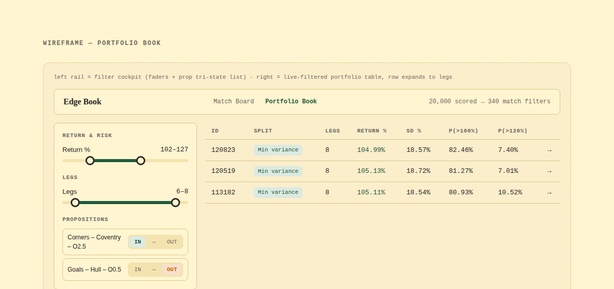
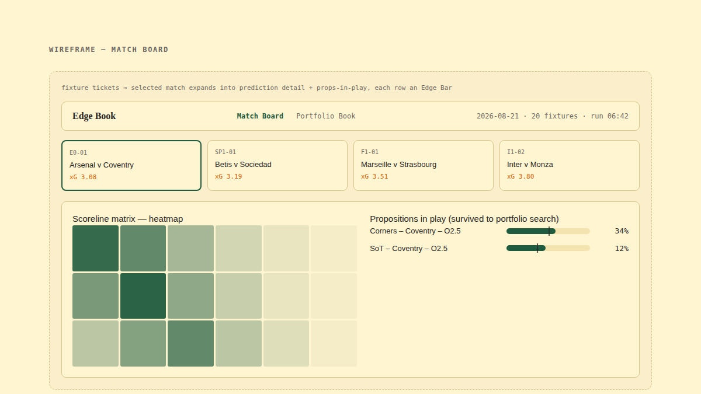

# proposition-portfolio

[](https://github.com/PKnott/proposition-portfolio/actions/workflows/tests.yml)

**Probabilistic forecasting of real-world events, measured against live market
prices, and turned into risk-managed portfolios.**

The project builds calibrated probability distributions for match statistics:
goals, shots, shots on target and corners, per team, across Europe's five top
leagues. It compares those distributions with real-world market odds to find
mispriced propositions. It then solves a portfolio problem: which combination of
positions to hold, how to weight them, and what fraction of capital to commit.
Every decision is scored on the portfolio's *exact* discrete return distribution
and stress-tested by simulation, not read off a normal approximation.

Sports markets are the test bed, not the point. They settle quickly, publicly and
in volume, which makes them a clean environment for the full quant loop:

**forecast → price comparison → portfolio construction → risk sizing →
simulation → out-of-sample attribution**



## What it demonstrates

| Area | In this project |
|---|---|
| **Probabilistic forecasting** | Gradient-boosted count models (XGBoost Poisson / Tweedie), with each predicted mean mapped to a full Poisson or Negative Binomial pmf. Dispersion is fitted per league on validation residuals |
| **Validation discipline** | Expanding-window walk-forward CV by season, record-before-update features, a withheld tuning season, and a test season scored exactly once |
| **Statistical testing** | Paired bootstrap CIs and Wilcoxon tests, with an edge counted only when both agree. Calibration is graded by ECE, Brier with its Murphy decomposition, calibration slope and Wilson bands |
| **Market pricing** | Model probabilities compared with real-world decimal odds. Edge is measured per proposition, and (probability, price) dominance is applied within each event |
| **Portfolio optimisation** | A three-objective frontier (expected return, variance, P(profit)) over up to ~10²³ candidate portfolios, found by a dynamic programme over a Minkowski sum |
| **Correlation modelling** | Positions in the same match are priced with a correlated joint distribution, clamped to Fréchet bounds |
| **Risk and sizing** | Edge-aware, Sharpe-optimal leg weights, a drawdown-constrained fraction of Kelly, and explicit model-risk haircuts |
| **Simulation** | 4,000-path × 100-round Monte Carlo for drawdown risk, and p5/p50/p95 wealth fans for compounding |
| **Engineering** | A typed Python package with 515 tests in CI, frozen and versioned model artifacts, resumable searches, and a self-contained interactive front end |

---

## Results

### Forecasting: held-out 2025/26 season

The test season was scored once, after every modelling decision had been frozen.
The baseline is the league's own average at the team's venue. Per-team log loss,
lower is better:

| Target | Fixtures | Baseline | Model | Improvement | Significant (bootstrap **and** Wilcoxon) |
|---|---|---|---|---|---|
| Goals | 1,797 | 1.505 | 1.446 | −3.9% | ✓ p = 2e-20 |
| Shots | 1,729 | 3.007 | 2.848 | −5.3% | ✓ p = 6e-48 |
| Shots on target | 1,729 | 2.253 | 2.147 | −4.7% | ✓ p = 3e-31 |
| Corners | 1,729 | 2.391 | 2.326 | −2.7% | ✓ p = 3e-26 |

Match totals are the harder question, because both teams' distributions are
convolved into one. On totals, shots and shots on target stay significant, but
goals and corners do not.

The goals result shows why two tests are required. The mean gain on goals totals
is positive and its bootstrap CI excludes zero, but the median gain is close to
zero, the model wins only 50.7% of fixtures, and Wilcoxon gives p = 0.49. The
edge sits in a minority of fixtures rather than shifting every prediction, so it
is not counted as significant.

On calibration, none of the per-team lines is graded *avoid*. Median calibration
slopes per target sit between 0.87 and 1.05, where 1 means the probabilities are
neither too extreme nor too timid.

### Portfolio and sizing: early measurements

> **Early results from a small sample.** These numbers come from the first study,
> run after **two settled slates** (29 and 30 August 2026: 286 qualifying
> propositions and 4,327 exported portfolios). The study will be repeated once
> more slates have settled; the international break has delayed that. Read them
> as early measurements, not established findings.

| | |
|---|---|
| **Sharpe² = Σ Sᵢ²** | Under edge-aware weights, portfolio Sharpe equals the square root of the summed squared leg Sharpes. This is an algebraic identity, so it does not depend on the sample. It was verified to 1e-16 on real slates and is pinned by a test. The result gives one scalar, additive over legs, that orders every possible selection. |
| **The protective stake ≈ 0.111 × Kelly** | The 4,000-path drawdown simulation turned out to compute a near-fixed fraction of Kelly (r = 0.998, worst residual 6.2%). A risk appetite that had been implicit in three configuration constants became one visible number. |
| **The old stake split cost ~39% of growth** | Minimum-variance weighting ignored edge. On one real book it put 25.5% of the stake on the worst position in it and 4.3% on the best. |
| **Same-match correlation +0.455; opposite teams −0.185** | Measured over 1,438 settled same-match pairs, against a placebo of −0.013 for pairs drawn from different matches. This led to pricing two positions per match with a correlated joint distribution instead of banning them. |

The study also caught an error in its own method. A sign flip in the correlation
model had overstated one result by 35%, and the correction is written up
alongside the findings rather than quietly applied.

**→ [The full study: *Edge capacity*](docs/edge-capacity.md)**. It covers what
portfolio size does to variance, stake and growth, why the stake split was the
bug, and what adding legs provably cannot fix.

---

## Methodology

### 1. Data

- **Match history** comes from Understat (goals, xG, npxG) and ESPN (fixtures and
  all-competition schedules).
- **Shots, shots on target and corners** are parsed from cached ESPN scoreboard
  JSON. That gives 21,949 fixtures back to 2013/14 with zero extra HTTP calls,
  instead of a ~20,000-request per-fixture pull, and joins to the Understat match
  table at 99.98% coverage.
- **Completeness is measured, not remembered.** `fpp.reconcile` checks that every
  league-season holds `teams × (teams − 1)` matches, which caught seasons frozen
  short that had gone unnoticed for months.
- **Real-world market odds** are sourced for each fixture and captured in a
  self-contained odds form. Each row carries its own model probability, so
  nothing downstream depends on joining strings back to the predictions.

### 2. Forecasting

There are four pooled models, one per target family, each trained across all five
leagues with `league` as a feature.

| Target | Objective | Distribution | Conditional var/mean |
|---|---|---|---|
| Goals | `count:poisson` | Poisson | ~1.0 |
| Shots | `reg:tweedie` | Negative Binomial | > 1 |
| Shots on target | `reg:tweedie` | Negative Binomial | > 1 |
| Corners | `reg:tweedie` | Negative Binomial | > 1 |

Every over/under line needs a full distribution, not just a mean. So each Tweedie
mean is mapped to a Negative Binomial whose dispersion is fitted per (target,
league). Match totals are the convolution of the two teams' pmfs.

Features are generated from a declarative spec rather than hand-coded:

```
{team, opp} × {goals, xg, npxg, shots, sot, corners} × {for, against} × {all-venue, venue}
```

These are recency-weighted rolling priors, plus context: venue, league, game week,
rest days, matches in the prior 14 days, and two promotion signals. That makes 59
candidate features. Promoted clubs are not seeded at the league average, which is
far too kind. Each is seeded from what promoted sides in that league actually
went on to do, then scaled by its own attack and defence in the division below.

### 3. Validation and model selection

- **Walk-forward CV.** Folds are expanding windows ordered by season, never a
  random split. Every feature is computed record-before-update, so a match never
  sees its own result.
- **Five-stage feature search.** The stages are isolate, merge, re-merge,
  eliminate and an exhaustive sweep. The search keeps the *smallest* model within
  tolerance, and it raises an error rather than ship a selection that is worse than
  the full model.
- **Alternating tuning.** The rolling window `(L, α)` and the learner's
  hyperparameters are tuned in turn until neither moves. Early stopping sets the
  number of trees.
- **Withheld season.** One season is held back from tuning to measure how much
  tuning overfitted. The test season is touched exactly once.
- **Frozen artifacts.** Each saved model carries a hash of both the feature spec
  and the scoring definition, so a model cannot be loaded under rules it was not
  built for.

### 4. Pricing and edge

For every proposition there is a model probability `p`, the best available market
price `o`, and an edge `e = p·o`. Only propositions with `e ≥ 1` qualify. Within
an event, only those on the (probability, price) frontier survive, because a
proposition with both a lower probability and a lower price than another can
never be the better choice.

### 5. Portfolio construction

Expected return, variance and P(profit) trade off against each other, so the
output is the **undominated set** rather than a single "best" portfolio. On one
real week, the highest expected return was a single position with a 141%
standard deviation, the lowest spread was a 26-leg portfolio at 9.9%, and the
highest P(profit), 95%, was neither of them.

When events may be skipped and a match may hold two positions, a real slate
offers **10²² to 10²³** portfolios, far too many to enumerate. Every quantity a
portfolio is judged on is a sum over its legs, so the reachable space is a
Minkowski sum, and a dynamic programme can walk it event by event. Below 2 × 10⁶ combinations the code enumerates exactly and
records which claim it is making. Against full enumeration on a 26-event slate,
the search found all 90 frontier portfolios exactly.

Two positions from the same match enter with a correlation graded by what they
share. The joint `P(both)` is clamped to the Fréchet bounds, so an impossible
correlation is never imposed. Each portfolio's full return distribution comes
from grid convolution, at about 1 ms per portfolio, vectorised across the pool. A
saddlepoint approximation was tried first and rejected: on lumpy discrete returns
it was several times less accurate than the grid.

### 6. Weighting and sizing

Each leg is weighted `wᵢ = μᵢ / vᵢ`, its edge over its variance. That weighting
maximises portfolio Sharpe over every possible weighting, and it is where the
Sharpe² = Σ Sᵢ² identity comes from. A per-leg cap limits concentration and
reports what it costs.

The fraction of the bankroll committed is the largest `f` that keeps
P(30% drawdown within 100 rounds) under 5%. It is read from 4,000 simulated paths
of the portfolio's *actual* discrete distribution, because at eight to twenty
win/lose legs a normal approximation misstates the tail. In one portfolio the
simulated P(return > 100%) was 75.6%, against about 66% from a normal fit with the
same mean and SD.

Two model-risk terms can haircut the stake: the error *shared* by every leg on a
slate, and its spread. Independent per-leg error is deliberately left out, because
it diversifies away; simulated books from 6 to 96 legs are indistinguishable from
a perfect model. Both terms stay at zero until the data supports a value.

### 7. Out-of-sample attribution

Every run is captured to a ledger keyed structurally on (date, league, teams,
market, team, line) and settled against results as they arrive. The analysis asks
four questions, in order:

1. Is the model better than the market price it is compared against?
2. Which markets and lines are calibrated?
3. Does claimed edge turn into realised return?
4. Which rule for choosing a portfolio off the frontier pays?

A slate contributes thousands of rows, but its portfolios are overlapping
combinations of the same few dozen propositions and move together. So every table
reports `n_slates` beside `n`, and nothing counts as evidence until `n_slates`
reaches double figures.

---

## The Edge Book

The final stage writes one self-contained HTML file. It needs no server.

* **Match Board.** Every fixture, with its scoreline heatmap, 1X2/BTTS compared
  with the league's own rates, and each line ladder with an edge bar wherever the
  market quoted a price.
* **Portfolio Book.** The undominated set, filtered live with range faders on
  every metric and include/exclude controls per proposition. The filter state
  lives in the URL.
* **Projection Book.** One portfolio compounded over 100 rounds, showing a
  p5/p50/p95 fan, the growth curve `g(f)`, a two-way return calculator, and every
  statistic on the portfolio. It states on the page that every number assumes the
  model's probabilities are right.



---

## Limitations

- **Independence within a match.** Goals scorelines multiply two independent
  Poissons, and the other targets' totals convolve two independent counts. Draws
  are slightly under-predicted at low scores.
- **Pre-match aggregates only.** There are no team sheets, injuries or in-play
  data.
- **Small settled sample.** The portfolio and sizing results rest on two settled
  slates so far. Between-slate variance, the one term that adding legs cannot
  diversify away, is effectively unmeasured.
- **Correlation structure.** The correlation model is imposed rather than learned,
  and it is estimated on the same early sample.
- **Conditional on the model.** Everything downstream of pricing assumes the model
  probabilities are right. If they are optimistic by more than about 8 percentage
  points across the board, the edge disappears.
- **No closing-line benchmark.** Closing prices are not captured yet, so
  closing-line value (CLV) cannot be measured.
- **Search coverage.** The portfolio search is not exhaustive above ~2 × 10⁶
  combinations. It keeps the frontier exactly and a band around it.

---

## Pipeline

| Stage | Notebook | What it does |
|---|---|---|
| Ingest | `00_Data_Pull` | Pull match history and fixtures |
| Clean | `01_Cleaning` | One canonical table; integrity and dispersion checks |
| Features | `02_Features` | Rolling priors, promotion seeds, feature selection |
| Tune | `03_Tuning` | Walk-forward CV; alternating window and hyperparameter search |
| Evaluate | `04_Evaluation` | Held-out season, touched once; significance and calibration |
| Predict | `05_Run` | Score fixtures; write the predictions workbook and the odds form |
| Portfolio | `06_Split` | Edge, portfolio search, sizing and the Edge Book |
| Settle | `fpp.ledger`, `fpp.analysis` | Capture, settle and attribute results (the driver notebook is not yet published) |

`fpp/` holds the logic, and the notebooks are thin drivers over it.

## Repository layout

```
fpp/                        the package
├── config.py  paths.py     league/target registries and constants, filesystem layout
├── spec.py                 declarative feature spec, the single source of truth
├── ingest/                 Understat, ESPN, scoreboard stats, retry plumbing
├── clean.py  reconcile.py  canonical table; completeness checked by measurement
├── priors.py  promoted.py  vectorised walk-forward priors; promoted-club seeding
├── build.py                feature matrix
├── models.py  metrics.py   objectives, Poisson/NB distributions, losses
├── cv.py  search/          season folds; resumable window/feature/hyperparameter search
├── artifacts.py            frozen, versioned artifacts and RunContext
├── evaluate.py             held-out scoring and significance tests
├── calibration.py          ECE, Brier decomposition, slope, quantile bands, verdicts
├── predict.py              production training and fixture scoring
├── staking.py              price, edge, dominance
├── portfolio.py            correlated pairs, frontier search, exact return distributions
├── growth.py               drawdown-constrained sizing and Monte Carlo projection
├── ledger.py  analysis.py  capture, settle and attribute
└── report/                 market probabilities, workbooks, Edge Book export

Notebooks/                  00 – 06 drivers
app/edge-book/              Edge Book front end (HTML, CSS, JS)
artifacts/<target>/<ver>/   frozen window, features, params, CV and provenance
docs/                       studies
tests/                      515 regression tests
```

## Reproducibility

- **Frozen artifacts.** `05_Run` never re-derives anything. It loads kilobyte-scale
  JSON artifacts and scores with them. `RunContext.load()` refuses an artifact
  frozen under a different feature spec or scoring definition.
- **Self-invalidating checkpoints.** Search checkpoint filenames carry a hash of
  the scoring mode, group structure, window and caps. When the metric changes, old
  rows become unreachable rather than silently reused.
- **Resumable searches.** Searches are append-only, so an interrupted run resumes
  where it stopped. Float keys are normalised so that "already done" lookups match.
- **Outputs by position, not date.** Each writer archives what it supersedes, so
  the output root only ever holds the current file. The ledger is the one store
  that cannot be rebuilt, and it sits where no cleanup routine can reach it.

---

## Setup

**Python 3.11+.**

```bash
python3 -m venv Advanced_Football_Project
source Advanced_Football_Project/bin/activate
pip install -r requirements.txt
pip install -e .
```

The venv lives in `Advanced_Football_Project/`. An empty `.venv/` is also present
and is not the environment.

**macOS notes**

- **SSL certificates.** A fresh python.org install has an empty trust store. Run
  `Install Certificates.command` from your Python install folder. `fpp` also
  points the stdlib at `certifi` on import, as a fallback.
- **OpenMP for XGBoost.** Run `brew install libomp`. Without Homebrew, run
  `python scripts/fix_xgboost_libomp.py`, which points XGBoost at the OpenMP
  runtime bundled with scikit-learn. Re-run it after upgrading XGBoost.

Large, regenerable files (the clean table and search checkpoints) live in
`~/.cache/football_prediction/`. Override that location with `FPP_CACHE_DIR`.

## Running it

**First build.** Run `00` → `04` once, in order. This pulls the history, builds
the dataset, selects features, tunes, and produces the held-out evaluation, and
it freezes `artifacts/` for all four targets.

**Each match round:**
1. `05_Run` scores the upcoming fixtures, in about 3–5 minutes, mostly network
   time. It writes `predictions_<date>.xlsx` and a blank `odds_input_<date>.xlsx`
   listing every proposition the fixtures are priced at.
2. Real-world market odds for each proposition are captured into the odds form.
3. `06_Split` reads the filled form and nothing else. It finds the qualifying
   propositions, searches the portfolio frontier, sizes each portfolio, and writes
   `edge_book_<date>.html`. Expect about 30–35 minutes on a full weekend slate.
   Most of that goes on the drawdown simulation run for each exported portfolio,
   not on the search.

`06_Split` has one main search control, `LEG_VAR`: how many qualifying events a
portfolio may leave out. At zero the space is small enough to enumerate exactly.

**Start of season.** Re-run `00_Data_Pull` with `MODE = "all"`.

**Re-validation.** Re-run `04_Evaluation` with the frozen parameters. Re-tune with
`03` only if performance drifts.

## Testing

```bash
pytest tests/ -q
```

Tests that depend on local data are skipped on a clean checkout. CI runs the suite
on Python 3.12 and 3.13.

## Future work

- A Dixon–Coles or bivariate-Poisson correction for 1X2 and correct-score markets
- Repeat the edge-capacity study once more slates have settled
- Calibrate the model-risk haircuts from settled data
- Closing-line capture, for a CLV benchmark on top of the ledger
- Lower English divisions; the pooling and promotion machinery is built for them
- Player availability and injury data

## Provenance

This project carries forward the modelling from
[`Football_Prediction_Project`](https://github.com/PKnott/Football_Prediction_Project),
a per-league prediction exercise. What changed:

- four pooled models instead of five per-league ones
- walk-forward validation instead of a single train/test split
- a package instead of duplicated notebooks

Everything about pricing, portfolio construction, sizing and simulation is new.
